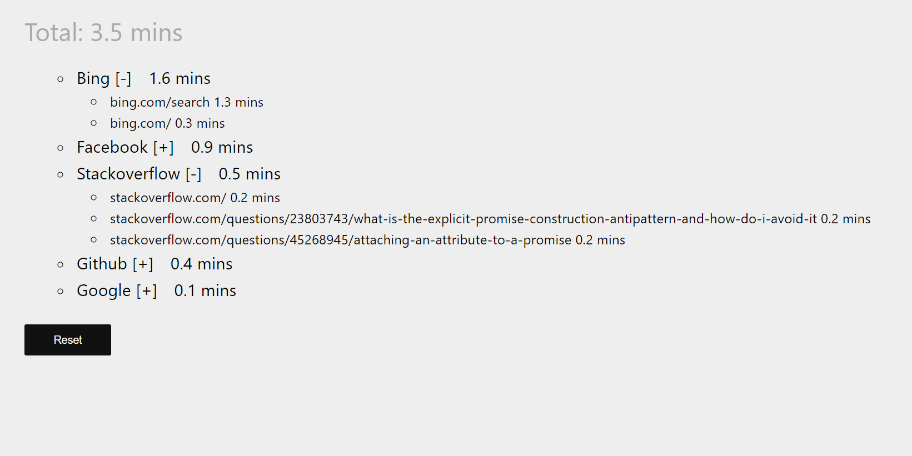

ce-incremental
---
A productivity Chrome Extension that logs the amount of time you spend on each website.

**Features**
* Extremely accurate - only tracks time on active tab, and only if browser window is active and focused.
* Easy to analyze - Sorts & groups your browsing urls so you can get insights at a glance.

Dev
---
**To test:** Enable `Developer mode` in Chrome Extensions page. Select `Load unpacked extension`, and browse to local dev directory.

**Debugging:**
`Right-click popup > inspect popup` for popup page debugging
`chrome://extensions > 'Inspect page' on extension info` for background script/content script debugging

*NOTE:* Must `Reload (Ctrl+R)` extension whenever you change background scripts or `manifest.json` via the Chrome Extensions page.

Info
---

Four commonly used components for a basic extension:

1. **Content-scripts** can directly access DOM.  The JS variables and functions from the tab and your content_scripts cannot interact. Furthermore, content-scripts *cannot use storage*.

2. . **One background Event Page** which Chrome either generates by concatenating an array of scripts **OR** is defined as one page, commonly named background.html.

3. `{"browser_action" : {"default_popup" : "popup.html"}}` is an optional user interface defined in manifest.json that is displayed when someone clicks your extension icon.  The popup can't see tab's DOM - it must be requested using `chrome.extension.sendMessage`